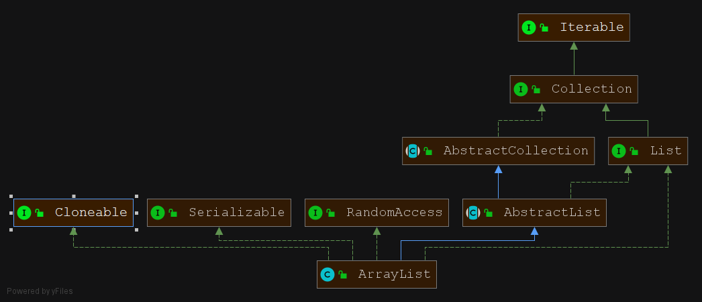
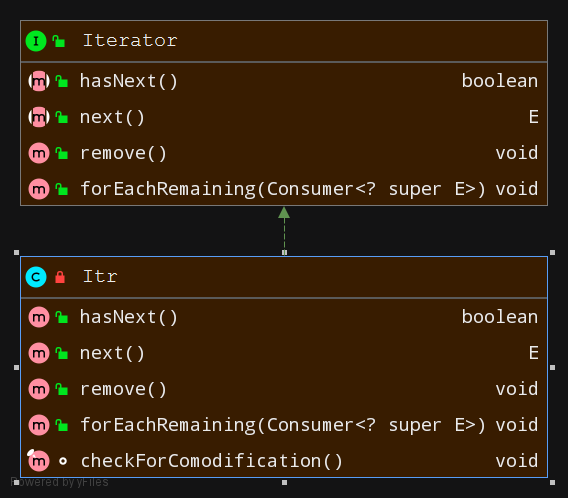

# 工厂方法

## 优点
- 1.用户只需要关心所需产品对应的工厂,无须关心创建细节
- 2.加入新产品符合开闭原则,提高可扩展性

## 缺点
- 类的个数容易过多,增加复杂度
- 增加了系统的抽象性和理解难度

## JDK中具体用到工厂方法的例子
> ### java.util.Collection

说明:
- 1.`Iterator<E>`类似于`Video`
- 2.`ArrayList`里面的`private class Itr implements Iterator<E>`类似于`JavaVideo`
- 3.`Collection` 接口中的方法 `Iterator<E> iterator();`类似于`VideoFactory`中的`public abstract Video getVideo();` 
- 4.`ArrayList`负责生产具体的`Iterator`




> ### java.net.URLStreamHandlerFactory

说明：
- 1.`URLStreamHandler`类似于`Video`
- 1.`sun.net.www.protocol.http.Handler`类似于`JavaVideo`
- 3.`URLStreamHandlerFactory` 接口中的方法`URLStreamHandler createURLStreamHandler(String protocol);`类似于  `VideoFactory`中的`public abstract Video getVideo();`
- 4.`com.sun.deploy.net.protocol.http.Handler`负责产生具体的`URLStreamHandler`

```java
com.sun.deploy.net.protocol.http;

import com.sun.deploy.util.URLUtil;
import java.io.IOException;
import java.net.URL;
import java.net.URLConnection;

public class Handler extends sun.net.www.protocol.http.Handler{
    
}
```

