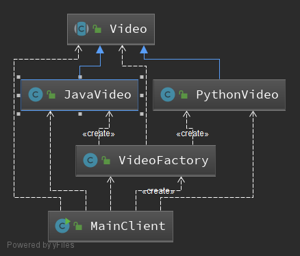
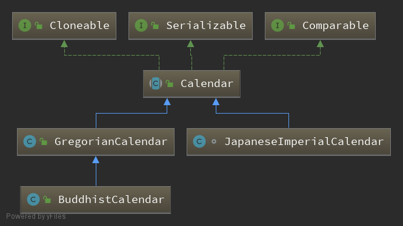
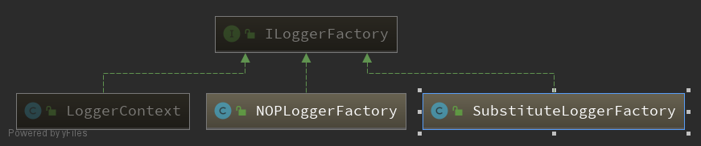

# 简单工厂

## 简单工厂模式的代码说明

> 说明： 
1. `PythonVideo`、`JavaVideo`都继承自`Video`抽象类。
2. `VideoFactory`可以传入类型来创建类,也可以通过类型名字来创建类，创建类可以通过Video接收。



### JDK中使用到的工厂模式

> ### Calendar.createCalendar




> ### mysql-connection-java中用到的简单工厂模式

> ### JDBC操作数据库步骤

1.`Class.forName(driver)`将Driver类加载到jvm
  
```java
package com.yangshengjie.jdbc;  
import java.sql.Connection;  
import java.sql.DriverManager;  
import java.sql.ResultSet;  
import java.sql.SQLException;  
import java.sql.Statement;  
public class JDBCTest {  
    public static void main(String[] args) {  
        // 数据库驱动类名的字符串  
        String driver = "com.mysql.jdbc.Driver";  
        // 数据库连接串  
        String url = "jdbc:mysql://127.0.0.1:3306/jdbctest";  
        // 用户名  
        String username = "root";  
        // 密码  
        String password = "mysqladmin";  
        Connection conn = null;  
        Statement stmt = null;  
        ResultSet rs = null;  
        try {  
            // 1、加载数据库驱动（ 成功加载后，会将Driver类的实例注册到DriverManager类中）  
            Class.forName(driver );  
            // 2、获取数据库连接  
            conn = DriverManager.getConnection(url, username, password);  
            // 3、获取数据库操作对象  
            stmt = conn.createStatement();  
            // 4、定义操作的SQL语句  
            String sql = "select * from user where id = 100";  
            // 5、执行数据库操作  
            rs = stmt.executeQuery(sql);  
            // 6、获取并操作结果集  
            while (rs.next()) {  
                System.out.println(rs.getInt("id"));  
                System.out.println(rs.getString("name"));  
            }  
        } catch (Exception e) {  
            //
        } finally {  
//           ...
        }  
    }  
}
```
> ### com.mysql.cj.jdbc.Driver

```java
package com.mysql.cj.jdbc;

import java.sql.SQLException;

public class Driver extends NonRegisteringDriver implements java.sql.Driver {
    static {
        try {
            java.sql.DriverManager.registerDriver(new Driver());
        } catch (SQLException E) {
            throw new RuntimeException("Can't register driver!");
        }
    }
    public Driver() throws SQLException {
        // Required for Class.forName().newInstance()
    }
}
```

> ### java.sql.DriverManager
> ### org.slf4j.LoggerFactory#getLogger
> ### org.slf4j.helpers.NOPLoggerFactory

1. 依赖
```xml
    <dependency>
        <groupId>ch.qos.logback</groupId>
        <artifactId>logback-classic</artifactId>
        <version>1.2.3</version>
    </dependency>
    <dependency>
        <groupId>ch.qos.logback</groupId>
        <artifactId>logback-classic</artifactId>
        <version>1.2.3</version>
    </dependency>
```


> ### ILoggerFactory的实现类

